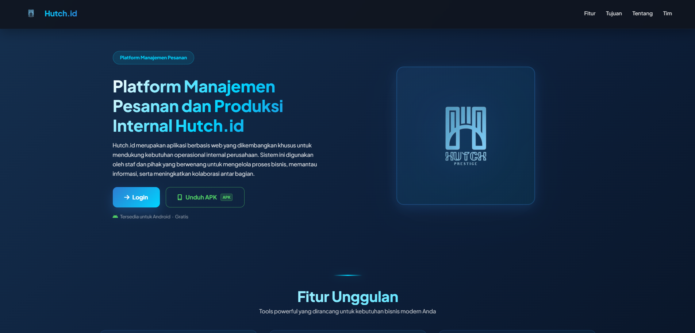
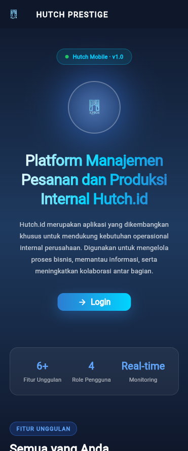

<div align="center">


<br/><br/>

# 👜 Hutch.id — OrderFlow System

### Sistem Manajemen Pesanan dan Produksi Internal Hutch.id
### Website + Aplikasi Mobile

_Tugas Besar Rekayasa Sistem Informasi — Kelas A1 Kelompok 2_  
_Program Studi Sistem Informasi — Universitas Kebangsaan Republik Indonesia (UKRI) 2026_

<br/>

[](https://hutch-prestige.my.id)

</div>

---

### 🌐 Website — Landing Page

<div align="center">
  
</div>

### 📱 Mobile — Landing Page

<div align="center">
  
</div>

---

## 📌 Tentang Proyek

**Hutch.id OrderFlow** adalah sistem manajemen pesanan terintegrasi yang terdiri dari **dua platform**:

| Platform | Teknologi | Fungsi |
|---|---|---|
| 🌐 **Website** | Laravel 10 + Bootstrap | Panel manajemen untuk admin, staf, dan operator |
| 📱 **Mobile App** | Flutter (Android) | Akses monitoring & operasional dari smartphone |

Sistem ini mengelola seluruh siklus pesanan pelanggan **hutch.id** — produsen tas konveksi dan brand lokal yang melayani custom production untuk bisnis maupun ready bags untuk umum.

---

## ✨ Fitur Utama

### 🌐 Website (Laravel)

| Fitur | Deskripsi |
|---|---|
| 📋 Penerimaan Order | Buat PO baru dengan nomor auto-generate format `PO-YYYYMMDD-XXX`, multi-item, harga dikunci saat simpan |
| 🔍 Cek Bahan Baku | Verifikasi stok otomatis saat PO disimpan; tampilkan tabel stok tersedia vs kebutuhan vs selisih |
| 🔄 Manajemen Status Produksi | 6 status terstruktur dengan audit trail lengkap; rollback stok otomatis jika PO dibatalkan |
| 📄 Cetak Dokumen PO ke PDF | Generate PDF dokumen PO resmi dalam ≤ 5 detik; link berbagi sementara valid 24 jam |
| 👥 Manajemen Pelanggan | CRUD data master pelanggan dengan autocomplete saat pembuatan PO |
| ✅ Tambah Produk (Staff) | Interface khusus staf penjualan untuk menambah produk baru dengan upload foto & preview |
| 🔔 Notifikasi Real-time | Notifikasi ke semua role saat ada PO baru, perubahan status, atau stok menipis |
| 📊 Dashboard Analitik | Ringkasan total PO aktif, menunggu konfirmasi, dan siap kirim secara real-time |
| 📁 Arsip PO | Akses arsip PO selesai/dibatalkan untuk Administrator  Hutch.id |
| 🔐 RBAC 4 Level | Role-based access control ketat untuk setiap fitur dan halaman |

### 📱 Mobile App (Flutter)

| Fitur | Deskripsi |
|---|---|
| 🏠 Dashboard Mobile | Ringkasan PO aktif, status produksi, dan statistik real-time |
| 📦 Manajemen Pesanan | Lihat, buat, dan update status PO langsung dari smartphone |
| 👤 Manajemen Pelanggan | CRUD data pelanggan dengan pencarian cepat |
| 🏪 Inventori & Stok | Monitoring stok bahan baku dan produk secara real-time |
| 🔔 Notifikasi Push | Notifikasi pesanan baru dan perubahan status produksi |
| 🤖 Asisten AI (Chatbot) | Terintegrasi workflow N8N untuk proses otomatis dan pencarian informasi |
| 📂 Arsip Digital | Akses arsip PO dan dokumen PDF dari mobile |
| 🔑 Multi-role Login | Login dengan 4 role berbeda; tampilan disesuaikan per peran |
| 📥 Unduh APK | APK tersedia langsung dari landing page website |

---

## 🔄 Alur Status Produksi

```
Menunggu Konfirmasi → Dikonfirmasi → Dalam Produksi → Siap Kirim → Selesai
                                                     ↘
                                                   Dibatalkan
```

- Pengurangan stok bahan baku dilakukan **satu kali** saat status → `Dalam Produksi`
- PO berstatus `Selesai` atau `Dibatalkan` bersifat **immutable** (tidak dapat diedit/dihapus)
- Rollback stok otomatis jika PO dibatalkan setelah `Dalam Produksi`

---

## 🛠️ Teknologi

### 🌐 Website

| Layer | Teknologi |
|---|---|
| Backend | Laravel 10.x, PHP 8.1+ |
| Frontend | Blade Templating, Bootstrap, HTML/CSS/JS |
| Database | MySQL |
| PDF | DOMPDF |
| Auth | Laravel Sanctum |
| DevOps | Docker, Docker Compose |

### 📱 Mobile

| Layer | Teknologi |
|---|---|
| Framework | Flutter (Dart) |
| State Management | Provider |
| Storage Lokal | SharedPreferences, SQLite (sqflite) |
| Auth | Token-based (Laravel Sanctum API) |
| Build | Android APK (Release) |

---

## 👥 Kelas Pengguna & Hak Akses

| Peran | Deskripsi | Hak Akses (ringkas) |
|---|---|---|
| Staf Penjualan | Menerima dan mencatat pesanan | Buat PO, edit PO sebelum konfirmasi, lihat/print PO, tambah produk baru |
| Operator Gudang | Petugas gudang / produksi | Lihat PO aktif, verifikasi bahan, tambah/kurangi stok, mulai produksi |
| Administrator | Admin sistem | Akses penuh: manajemen user, konfigurasi, arsip, dan semua aksi operasional |

---

## 📁 Struktur Repository

```
hutch_id_Kelompok2/
├── hutch_id_Website_OrderFlow/        # 🌐 Project Laravel (Website)
│   ├── app/
│   │   ├── Http/Controllers/
│   │   ├── Models/
│   │   ├── Policies/
│   │   └── Middleware/
│   ├── database/
│   │   ├── migrations/
│   │   └── seeders/
│   ├── resources/views/
│   ├── routes/
│   │   ├── web.php
│   │   └── api.php
│   ├── public/
│   │   └── downloads/
│   │       └── Hutch-mobile.apk       # APK hasil build Flutter
│   ├── docker-compose.yml
│   ├── .env.example
│   └── .env.production
│
├── hutch_id_mobile_orderflow/         # 📱 Project Flutter (Mobile)
│   ├── lib/
│   │   ├── config/
│   │   │   └── app_config.dart        # Konfigurasi URL API
│   │   ├── models/
│   │   ├── providers/
│   │   └── screens/
│   │       ├── landing/
│   │       ├── auth/
│   │       ├── home/
│   │       ├── pesanan/
│   │       ├── pelanggan/
│   │       ├── gudang/
│   │       ├── notifikasi/
│   │       ├── arsip/
│   │       └── chatbot/
│   ├── android/
│   └── pubspec.yaml
│
└── docs/
    └── screenshots/                   # Screenshot untuk README
        ├── website-landing.png
        └── mobile-landing.png
```

---

## 📖 Cara Penggunaan

### 🌐 Akses Website

1. Buka browser dan kunjungi **[https://hutch-prestige.my.id](https://hutch-prestige.my.id)**
2. Klik tombol **Login** pada landing page
3. Masukkan email dan password sesuai role Anda
4. Sistem akan otomatis mengarahkan ke dashboard sesuai peran

---

### 👤 Panduan Per Role

#### 📋 Staf Penjualan
| Langkah | Aksi |
|---|---|
| 1 | Login dengan akun Staf Penjualan |
| 2 | Klik **"Buat PO Baru"** di dashboard atau menu Pesanan |
| 3 | Pilih pelanggan (atau tambah pelanggan baru jika belum ada) |
| 4 | Tambahkan item produk, jumlah, dan harga — nomor PO di-generate otomatis |
| 5 | Klik **Simpan** — stok bahan baku langsung diverifikasi otomatis |
| 6 | Jika stok bahan baku **tidak mencukupi** → sistem menampilkan tabel selisih stok → Staf dapat mengirim **notifikasi stok kurang** ke Operator Gudang langsung dari halaman tersebut |
| 7 | PO masuk status **"Menunggu Konfirmasi"** dan notifikasi dikirim ke semua role |
| 8 | Untuk menambah produk baru: buka menu **Produk** → **Tambah Produk** → upload foto & isi detail |

#### 🏭 Operator Gudang
| Langkah | Aksi |
|---|---|
| 1 | Login dengan akun Operator Gudang |
| 2 | Cek menu **Notifikasi** — jika ada stok kurang, akan muncul notifikasi dari Staf Penjualan beserta detail bahan baku yang kurang dan jumlah kekurangannya |
| 3 | Buka menu **Inventori** → pilih bahan baku yang kurang → klik **"Tambahkan Stok"** → isi jumlah penambahan → 

#### 🔐 Administrator
| Langkah | Aksi |
|---|---|
| 1 | Login dengan akun Administrator |
| 2 | Dashboard menampilkan ringkasan seluruh PO aktif, menunggu konfirmasi, dan siap kirim |
| 3 | Akses menu **Pesanan** untuk memantau dan mengelola semua PO |
| 4 | Ubah status PO ke **"Selesai"** setelah pengiriman dikonfirmasi |
| 5 | PO yang dibatalkan: buka detail PO → klik **"Batalkan"** — stok otomatis di-rollback |
| 6 | Akses menu **Arsip** untuk melihat seluruh riwayat PO selesai/dibatalkan |
| 7 | Kelola data pengguna melalui menu **Manajemen User** |

---

### 📄 Cetak & Bagikan Dokumen PO

1. Buka detail PO yang ingin dicetak
2. Klik tombol **"Cetak PDF"** — dokumen PDF di-generate dalam ≤ 5 detik
3. Untuk berbagi: klik **"Salin Link"** — link sementara valid selama **24 jam**
4. Kirimkan link ke pihak yang membutuhkan (pelanggan, tim internal, dll)

---

### 📱 Instalasi & Penggunaan Aplikasi Mobile

#### Download & Install APK
1. Buka **[https://hutch-prestige.my.id](https://hutch-prestige.my.id)** di browser HP Android
2. Klik tombol **"Unduh APK"** pada landing page
3. Setelah download selesai, buka file `Hutch-mobile.apk`
4. Jika muncul peringatan keamanan → buka **Pengaturan HP → Keamanan → Izinkan Sumber Tidak Dikenal**
5. Ikuti proses instalasi hingga selesai
6. Buka aplikasi **Hutch Prestige** dari layar utama HP

#### Login & Penggunaan Mobile
1. Masukkan email dan password sesuai role Anda
2. Dashboard mobile menampilkan ringkasan PO aktif dan statistik real-time
3. Navigasi menggunakan menu bawah untuk akses fitur: Pesanan, Pelanggan, Inventori, Notifikasi, Arsip
4. Fitur **Chatbot AI** tersedia di menu pojok kanan bawah untuk bantuan otomatis

> **Catatan:** Pastikan HP terhubung ke internet. Aplikasi mobile terhubung langsung ke server hutch-prestige.my.id secara real-time.

---

## 🚀 Cara Menjalankan

### 🌐 Website (Docker — Direkomendasikan)

**Prasyarat:** Docker & Docker Compose terinstall

```bash
# 1. Clone repository
git clone https://github.com/byedriand/hutch_id_Kelompok2.git
cd hutch_id_Kelompok2/hutch_id_Website_OrderFlow

# 2. Salin file environment
cp .env.example .env

# 3. Jalankan dengan Docker
docker compose up --build -d

# 4. Generate app key & setup database
docker compose exec app php artisan key:generate
docker compose exec app php artisan migrate --seed
docker compose exec app php artisan storage:link
```

Akses aplikasi di: **`http://localhost:8082`**

---

### 🖥️ Website (XAMPP / Lokal)

```bash
cd hutch_id_Website_OrderFlow

composer install
npm install
cp .env.example .env

# Edit .env sesuaikan DB_HOST, DB_PORT, DB_DATABASE, dll

php artisan key:generate
php artisan migrate --seed
php artisan storage:link
npm run build
php artisan serve
```

Akses aplikasi di: **`http://localhost:8000`**

---

### 📱 Mobile (Flutter)

**Prasyarat:** Flutter SDK & Android SDK terinstall

```bash
cd hutch_id_mobile_orderflow

# Sesuaikan URL API di lib/config/app_config.dart:
# Lokal  → 'http://localhost:8082/api'
# Hosting → 'https://domain-kamu.com/api'

flutter pub get

# Jalankan di emulator (development)
flutter run

# Build APK release (distribusi)
flutter build apk --release
# Output: build/app/outputs/flutter-apk/app-release.apk
```

---

## 🔑 Akun Default (Seeder)

| Role | Email | Password |
|---|---|---|
| Administrator | admin@hutch.id | password123 |
| Staf Penjualan | staf@hutch.id | password123 |
| Operator Gudang | gudang@hutch.id | password123 |

---

## 🛣️ API Routes (Mobile ↔ Website)

Base URL: `/api` | Auth: Bearer Token (Laravel Sanctum)

| Method | Route | Deskripsi | Auth |
|---|---|---|---|
| POST | `/login` | Login & dapat token | - |
| POST | `/logout` | Logout & hapus token | ✅ |
| GET | `/dashboard` | Data ringkasan dashboard | ✅ |
| GET/POST | `/pesanan` | List & buat PO baru | ✅ |
| GET/PUT | `/pesanan/{id}` | Detail & update PO | ✅ |
| PATCH | `/pesanan/{id}/status` | Update status produksi | ✅ |
| GET | `/pesanan/{id}/pdf` | Download PDF PO | ✅ |
| GET/POST/PUT/DELETE | `/pelanggan` | CRUD data pelanggan | ✅ |
| GET/POST/PUT/DELETE | `/produk` | CRUD data produk | ✅ |
| GET | `/notifikasi` | List notifikasi user | ✅ |
| GET | `/arsip` | Arsip PO selesai/batal | ✅ |
| GET | `/user` | Data profil user login | ✅ |

---

## 🗄️ Desain Basis Data

| Tabel | Deskripsi |
|---|---|
| `users` | Data pengguna dengan role RBAC |
| `pesanan` | Master seluruh PO — `nomor_po` bersifat UNIQUE |
| `detail_pesanan` | Item produk per PO; harga dikunci saat PO dibuat |
| `pelanggan` | Master data pelanggan mitra |
| `produk` | Data produk beserta stok dan foto |
| `histori_status_po` | Audit trail setiap perubahan status PO |
| `notifikasi` | Notifikasi per role/user |

---

## 🔒 Keamanan

- **Role-Based Access Control (RBAC)** dengan 4 level pengguna di website dan mobile
- Autentikasi API menggunakan **Laravel Sanctum** (Bearer Token)
- Link berbagi PDF menggunakan **token acak** dan kedaluwarsa dalam 24 jam
- APK mobile hanya tersedia via unduhan langsung dari website resmi hutch.id

---

## 🔔 Perkembangan Terbaru

### Versi 1.4 — Juli 2026 *(Current)*

- ✅ **Aplikasi Mobile Flutter** selesai dikembangkan dan siap distribusi
- ✅ **APK Release** (`Hutch-mobile.apk`) tersedia untuk diunduh dari landing page website
- ✅ **Landing Page Mobile** dengan 4 pilar keunggulan sistem, fitur unggulan, tim, dan info aplikasi
- ✅ **Navbar Mobile** diperbaiki — judul HUTCH PRESTIGE kini tetap (pinned) saat scroll
- ✅ **Card 4 Pilar** diperbaiki — teks tidak lagi terpotong, tampil penuh dan rapi
- ✅ **Integrasi API** website ↔ mobile menggunakan Laravel Sanctum
- ✅ **Asisten AI/Chatbot** terintegrasi workflow N8N
- ✅ **Persiapan hosting** — `.env.production` siap, struktur file lengkap untuk deployment

### Versi 1.3 — Juni 2026

- ✅ Menu "Tambah Produk" khusus role `staf_penjualan`
- ✅ Grid display produk responsive dengan upload foto & preview
- ✅ Notifikasi otomatis ke semua role saat produk baru ditambahkan
- ✅ Fix image display APP_URL mismatch (port 8000 vs 8082)

### Versi 1.2 — Sebelumnya

- ✅ Notifikasi `stok_kurang` menyimpan detail kekurangan per produk
- ✅ Auto-update notifikasi saat stok ditambahkan
- ✅ Form edit stok: Tambahkan Stok & Kurangi Stok
- ✅ Dashboard menampilkan indikator "Kurang" dengan jumlah unit

---

## 👥 Tim Pengembang

| Nama | NPM | Role |
|---|---|---|
| Nayla Rabia Gustari | 20241320034 | Project Manager |
| Adrian Ronald Daga | 20241320011 | Backend |
| Muhamad Alvin Ramadhan | 20241320035 | Frontend  |
| Sopyan Rinaldhi | 20241320028 | QA Tester (Mobile) |
| Eka Febryanto | 20241320014 | QA Tester (Website) |
| Julia Habibah | 20241320020 | Sistem Analis |
| Akbar | 20241320017 | QA Tester (Mobile) |

---

## 🏫 Informasi Akademik

| | |
|---|---|
| Mata Kuliah | Rekayasa Sistem Informasi |
| Program Studi | Sistem Informasi |
| Universitas | Kebangsaan Republik Indonesia (UKRI) |
| Kelas | A1 — Kelompok 2 |
| Tahun | 2026 |

---

## 📄 Lisensi

Proyek ini dibuat untuk keperluan akademik. Seluruh hak cipta milik Kelompok 2 — Program Studi Sistem Informasi UKRI 2026.

---

<div align="center">


_Hutch.id · Custom Production for Businesses, Ready Bags for Everyone_

🌐 [hutch-prestige.my.id](https://hutch-prestige.my.id) · 📱 Mobile App

</div>
